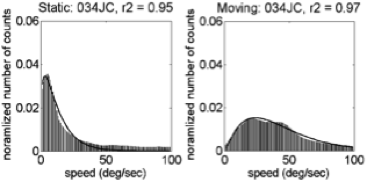
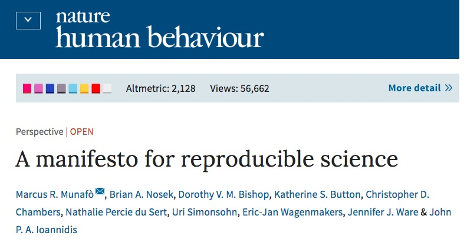

URISE Talk
================
Rick Gilmore
2017-03-30 16:05:55

<span class="talktitle">Go with the flow: Babies, brains, behavior & open science</span>

### **Rick O. Gilmore**

*Support*: NSF BCS-1147440, NSF BCS-1238599, NICHD U01-HD-076595

 

Goals
-----

-   A bit about me
-   A bit about my research
-   Sharing the goodness: Let's make science open

A bit about me
==============

Background
----------

-   Associate Professor of Psychology
-   Founding Director of Human Imaging at Penn State's SLEIC
-   Co-founder and Co-Director of the Databrary.org digital library
-   A.B., Cognitive Science, Brown; M.S. & Ph.D., Psychology, Carnegie Mellon University
-   Folk music, theatre, poetry, cycling, hiking, paddling, hiking/backpacking, amateur radio (K3ROG)

A bit about my research
=======================

Questions
---------

-   What is optic flow?
-   Why is optic flow important?
-   How does optic flow sensitivity develop?
-   How do brain systems for processing optic flow develop?
-   What shapes these patterns of development?

Approach
--------

-   **EEG measures** of brain responses to optic flow
-   **Psychophysical (behavioral) measures** of optic flow perception
-   **Empirical measures** of experienced optic flow across development from head-mounted video cameras

What is Optic Flow?
-------------------

-   Structured pattern of visual motion generated by observer movement

------------------------------------------------------------------------

<iframe width="560" height="315" src="https://www.youtube.com/embed/o27tIdYggY0" frameborder="0" allowfullscreen>
</iframe>
Cute kid playing hide and seek wearing GoPro camera.

Types of Optic Flow
-------------------


------------------------------------------------------------------------

<a href="">  </a>

[(Yu et al. 2010)](http://doi.org/10.1152/jn.01085.2009)

Figure from Yu et al., 2010 of MSTd receptive fields. These parse the space of different types of optic flow. You can think of them as basic features of flow.

------------------------------------------------------------------------


Why is optic flow important?
----------------------------

-   Geometry of environment
    -   Surface layout, orientation
    -   Object motion
-   Direction, speed of self-motion
    -   Rotation, translation
    -   Visual proprioception (eye vs. head vs. body)

Flow and self-motion
--------------------


How Does Optic Flow Sensitivity Develop?
----------------------------------------

-   Sensitivity at birth, [(Jouen et al. 2000)](10.1016/S0163-6383(01)00044-3)

[(R. Gilmore et al. 2007)](http://doi.org/10.1017/S0952523807070769)
--------------------------------------------------------------------

4-6 mo-old infants: Larger brain responses to **linear** patterns.

------------------------------------------------------------------------

<div class="centered">


[(Hou et al. 2009)](http://doi.org/10.1016/j.visres.2009.08.007)
----------------------------------------------------------------

4-6 mo-old infants: Larger brain responses to **faster** speeds.

------------------------------------------------------------------------


[(Kiorpes and Movshon 2004)](http://doi.org/10.1017/S0952523804216054)
----------------------------------------------------------------------

Sensitivity to slow (linear) speeds develops slowly in monkeys.

------------------------------------------------------------------------

<div class="centered">


How Do Children's Brains Respond to Flow?
-----------------------------------------

-   If infant-like: stronger responses to **fast, linear flows**.
-   If adult-like: stronger responses to **slow, radial flows**.
-   If in-between:
    -   fast + radial OR
    -   slow + linear

Brain responses to flow
-----------------------

Methods
-------

-   Time-varying optic flow patterns.
-   Steady-state visual evoked potentials (SSVEPs).
    -   Event-related EEG technique.
    -   Phase-locked responses at low-order harmonics.
-   n=29 4-8 year-olds.

2 deg/s translation
-------------------

<div class="centered">
<video width="750" height="450" controls>
<source src="https://nyu.databrary.org/slot/9825/-/asset/11635/download?inline=true" type="video/mp4"> Your browser does not support the video tag.
</video>
</br> <https://nyu.databrary.org/volume/75/slot/9825/->

4 deg/s rotation
----------------

<div class="centered">
<video width="750" height="450" controls>
<source src="https://nyu.databrary.org/slot/9825/-/asset/11649/download?inline=true" type="video/mp4"> Your browser does not support the video tag.
</video>
</br> <https://nyu.databrary.org/volume/75/slot/9825/->

8 deg/s radial
--------------

<div class="centered">
<video width="750" height="450" controls>
<source src="https://nyu.databrary.org/slot/9825/-/asset/11645/download?inline=true" type="video/mp4"> Your browser does not support the video tag.
</video>
</br> <https://nyu.databrary.org/volume/75/slot/9825/->

[1F1 Channel-Wise Results](https://raw.githubusercontent.com/gilmore-lab/gilmore-thomas-fesi-2015/master/figs/1F1/child/figX-channel-wise-effects-1.png)
--------------------------------------------------------------------------------------------------------------------------------------------------------


[(R. Gilmore, Thomas, and Fesi 2016)](http://doi.org/10.1371/journal.pone.0157911)

[1F1 Channels *p* &lt; .0005](https://raw.githubusercontent.com/gilmore-lab/gilmore-thomas-fesi-2015/master/figs/1F1/child/figX-vector-amplitude-barplots-pattern-1.png)
------------------------------------------------------------------------------------------------------------------------------------------------------------------------


[(R. Gilmore, Thomas, and Fesi 2016)](http://doi.org/10.1371/journal.pone.0157911)

[Complex Domain Plot of 1F1 Channels](https://raw.githubusercontent.com/gilmore-lab/gilmore-thomas-fesi-2015/master/figs/1F1/child/figX-complex-domain-plots-pattern-1.png)
---------------------------------------------------------------------------------------------------------------------------------------------------------------------------


[(R. Gilmore, Thomas, and Fesi 2016)](http://doi.org/10.1371/journal.pone.0157911)

1F1 Results Summary
-------------------

-   Highly responsive channels over right lateral cortex
-   Radial & rotation &gt;&gt; translation
-   Amplitude and phase differences

[3F1 Channel-Wise Results](https://rawgit.com/gilmore-lab/gilmore-thomas-fesi-2015/master/figs/3F1/child/channel-wise-effects-1.png)
------------------------------------------------------------------------------------------------------------------------------------


[(R. Gilmore, Thomas, and Fesi 2016)](http://doi.org/10.1371/journal.pone.0157911)

[3F1 Channels *p* &lt; .0005](https://raw.githubusercontent.com/gilmore-lab/gilmore-thomas-fesi-2015/master/figs/3F1/child/figX-vector-amplitude-barplots-speed-1.png)
----------------------------------------------------------------------------------------------------------------------------------------------------------------------


[(R. Gilmore, Thomas, and Fesi 2016)](http://doi.org/10.1371/journal.pone.0157911)

[Complex Domain Plot of 3F1 Channels](https://rawgit.com/gilmore-lab/gilmore-thomas-fesi-2015/master/figs/3F1/child/figX-complex-domain-plots-speed-1.png)
----------------------------------------------------------------------------------------------------------------------------------------------------------


[(R. Gilmore, Thomas, and Fesi 2016)](http://doi.org/10.1371/journal.pone.0157911)

3F1 Results Summary
-------------------

-   Highly responsive channels over medial cortex
-   Speed, but not pattern tuned, 2 &lt; 4 = 8 deg/s
-   Amplitude and phase differences

Results Summary
---------------

-   Anatomical separation of responses
    -   speed (medial)
    -   vs. pattern (lateral)
-   Radial & rotation &lt;&gt; translation, phase & amplitude
-   Speed tuning

[Children's 1F1](https://raw.githubusercontent.com/gilmore-lab/gilmore-thomas-fesi-2015/master/figs/1F1/child/figX-channel-wise-effects-1.png)
----------------------------------------------------------------------------------------------------------------------------------------------


[(R. Gilmore, Thomas, and Fesi 2016)](http://doi.org/10.1371/journal.pone.0157911)

[Adults' 1F1](https://raw.githubusercontent.com/gilmore-lab/gilmore-thomas-fesi-2015/master/figs/1F1/adult/figX-channel-wise-effects-1.png)
-------------------------------------------------------------------------------------------------------------------------------------------


[(R. Gilmore, Thomas, and Fesi 2016)](http://doi.org/10.1371/journal.pone.0157911)

[Children's 3F1](https://raw.githubusercontent.com/gilmore-lab/gilmore-thomas-fesi-2015/master/figs/3F1/child/figX-channel-wise-effects-1.png)
----------------------------------------------------------------------------------------------------------------------------------------------


[(R. Gilmore, Thomas, and Fesi 2016)](http://doi.org/10.1371/journal.pone.0157911)

[Adults' 3F1](https://raw.githubusercontent.com/gilmore-lab/gilmore-thomas-fesi-2015/master/figs/3F1/adult/figX-channel-wise-effects-1.png)
-------------------------------------------------------------------------------------------------------------------------------------------


[(R. Gilmore, Thomas, and Fesi 2016)](http://doi.org/10.1371/journal.pone.0157911)

Developmental Effects
---------------------

-   Children adult-like in many respects
    -   Lateral "pattern" responses @ 1F1
    -   Medial "speed" responses @ 3F1 (and 1F2)
-   Children activate fewer channels

Behavioral responses to flow
----------------------------

Methods
-------

-   Time-varying optic flow
    -   Radial, linear
    -   {2 deg/s, 8 deg/s}
    -   {5, 10, 15, 20%} coherence (adults)
    -   {15, 30, 45, 60%} and {20, 40, 60, 80%} (children)

------------------------------------------------------------------------


Methods
-------

-   n=30 children (4.3–8.6 yrs, M = 6.5 yrs, 19 Female)
    -   <https://nyu.databrary.org/volume/218>
-   n=30 adults (18.7–23.9 yrs, M = 20.8 yrs, 16 female)
    -   <http://doi.org/10.17910/B7V88T>
    -   [(Adamiak et al. 2015)](http://doi.org/10.1167/15.12.1008)

Children's responses *p*(correct)
---------------------------------


Adults' responses *p*(correct)
------------------------------


[(Adamiak et al. 2015)](http://doi.org/10.1167/15.12.1008)

Speed effects in children
-------------------------


Speed effects in adults
-----------------------


[(Adamiak et al. 2015)](http://doi.org/10.1167/15.12.1008)

Pattern effects in children
---------------------------


Pattern effects in adults
-------------------------


[(Adamiak et al. 2015)](http://doi.org/10.1167/15.12.1008)

Behavioral Summary
------------------

-   Children's behavior: more accurate to detect **fast** speeds, **radial** patterns
-   Adults more accurate to detect **slow** speeds, **radial** patterns

Measuring the statistics of visual experiences
----------------------------------------------

------------------------------------------------------------------------


Potential factors shaping development of flow sensitivity
---------------------------------------------------------

-   External
    -   Environment
-   Internal
    -   Posture
    -   Locomotion, head, eye movements

Head mounted eye tracker data from "coupled" infant/mom dyads
-------------------------------------------------------------


Adolph, K. (2015). Active vision in passive locomotion: real-world free viewing in infants and adults. Databrary. Retrieved February 18, 2017 from <http://doi.org/10.17910/B7.123>

Mothers
-------

<div class="centered">
<video width="640" height="480" controls>
<source src="https://nyu.databrary.org/slot/8239/-/asset/19181/download?inline=true" type="video/mp4"> Your browser does not support the video tag.
</video>
<https://nyu.databrary.org/slot/8239/-/asset/19181/download?inline=true>
<div>

--&gt;

------------------------------------------------------------------------

<video width="640" height="480" controls>
<source src="https://nyu.databrary.org/slot/11680/0,24500/asset/41871/download?inline=true" type="video/mp4"> Your browser does not support the video tag.
</video>

------------------------------------------------------------------------

<video width="640" height="480" controls>
<source src="https://nyu.databrary.org/slot/11680/25500,50000/asset/41873/download?inline=true" type="video/mp4"> Your browser does not support the video tag.
</video>

------------------------------------------------------------------------

<video width="640" height="480" controls>
<source src="https://nyu.databrary.org/slot/11680/51000,75500/asset/41875/download?inline=true" type="video/mp4"> Your browser does not support the video tag.
</video>

Findings
--------


[(Raudies and Gilmore 2014)](http://doi.org/10.1162/NECO_a_00645)

Findings
--------

-   Infant (passengers) experience faster visual speeds than mother
-   Controlling for speed of locomotion, environment

Experienced flow across cultures
--------------------------------

<video width="532" height="400" controls>
<source src="https://nyu.databrary.org/slot/11630/1567557,1747248/asset/39854/download?inline=true" type="video/mp4"> Your browser does not support the video tag.
</video>
Jayaraman, S., Smith, L.B., Raudies, F. & Gilmore, R.O. (2014). Natural Scene Statistics of Visual Experience Across Development and Culture. Databrary. Retrieved February 18, 2017 from <http://doi.org/10.17910/B7988V>

[(R. O. Gilmore, Raudies, and Jayaraman 2015)](10.1109/DEVLRN.2015.7345450)

------------------------------------------------------------------------

 

------------------------------------------------------------------------

| Country | Females | Males | Age (wks) | Coded video Hrs |
|---------|---------|-------|-----------|-----------------|
| India   | 17      | 13    | 3-63      | 3.1 (0.5-6.0)   |
| U.S.    | 15      | 19    | 4-62      | 4.6 (0.2-7.6)   |

</br> </br> [(R. O. Gilmore, Raudies, and Jayaraman 2015)](10.1109/DEVLRN.2015.7345450)

Illustrative Speed Histograms - 6 weeks
---------------------------------------

 

[(R. O. Gilmore, Raudies, and Jayaraman 2015)](10.1109/DEVLRN.2015.7345450)

Illustrative Speed Histograms -- 34 weeks
-----------------------------------------

 

[(R. O. Gilmore, Raudies, and Jayaraman 2015)](10.1109/DEVLRN.2015.7345450)

Illustrative Speed Histograms -- 58 weeks
-----------------------------------------

 

[(R. O. Gilmore, Raudies, and Jayaraman 2015)](10.1109/DEVLRN.2015.7345450)

Pattern Correlation Results
---------------------------


[(R. O. Gilmore, Raudies, and Jayaraman 2015)](10.1109/DEVLRN.2015.7345450)

Conclusions: Measuring experienced flow
---------------------------------------

-   Fast speeds, broad speed distributions
-   Linear flow &gt;&gt; radial or rotational flow

Summing up
----------

-   Infants commonly experience fast, linear optic flows
    -   Body size, posture, head position/stability
    -   Similar patterns across cultures
-   Brain and behavioral responses to optic flow develop throughout childhood
    -   Still immature in 5-8 year-olds
-   Changes in the statistics of experienced optic flow shape brain and behavioral development in infancy, and likely beyond

Sharing the goodness: Let's make science open
=============================================

------------------------------------------------------------------------


<http://www.nature.com/news/cancer-reproducibility-project-releases-first-results-1.21304>

------------------------------------------------------------------------



<http://www.nature.com/articles/s41562-016-0021>

------------------------------------------------------------------------

<iframe src="https://databrary.org">
</iframe>
Let's not waste a good crisis
-----------------------------

-   [Databrary.org](http://databrary.org): share video, procedures/tasks, data
    -   Video the **best** way to capture, share procedures
    -   Gilmore, R. O., & Adolph, K. E. (2017, February 9). Video can make science more open, transparent, robust, and reproducible. Retrieved from <http://osf.io/3kvp7>
-   [Open Science Framework (OSF)](http://osf.io): share non-identifiable materials, data

Let's not waste a good crisis
-----------------------------

-   [RStudio](https://www.rstudio.com) or [Jupyter](http://jupyter.org) for reproducible notebooks, workflows, analyses, & presentations
-   [GitHub](http://github.com): share flat-files & code, version control
-   PSY 511 Spring 2016 course, <http://psu-psychology.github.io/psy-511-reproducible-research-spring-2017>

Acknowledgements
----------------

*Collaborators*: Karen Adolph (NYU); Jeremy Fesi (U.S. Marine Corps Research); John Franchak (UC-Riverside); Swapnaa Jayaraman (Indiana University); Kari Kretch; Ennio Mingolla, (Northeastern); Florian Raudies (LinkedIn); Amanda Thomas (Swarthmore).

*Support*: NSF BCS-1147440, NSF BCS-1238599, NICHD U01-HD-076595

Stack
-----

This talk was produced in [RStudio](http://rstudio.com) version 1.0.136 on 2017-03-30. The code used to generate the slides can be found at <http://github.com/gilmore-lab/urise-2017-03-30/>. Information about the R Session that produced the code is as follows:

``` r
sessionInfo()
```

    ## R version 3.3.2 (2016-10-31)
    ## Platform: x86_64-apple-darwin13.4.0 (64-bit)
    ## Running under: OS X El Capitan 10.11.6
    ## 
    ## locale:
    ## [1] en_US.UTF-8/en_US.UTF-8/en_US.UTF-8/C/en_US.UTF-8/en_US.UTF-8
    ## 
    ## attached base packages:
    ## [1] stats     graphics  grDevices utils     datasets  methods   base     
    ## 
    ## loaded via a namespace (and not attached):
    ##  [1] backports_1.0.5 magrittr_1.5    rsconnect_0.7   rprojroot_1.2  
    ##  [5] htmltools_0.3.5 tools_3.3.2     yaml_2.1.14     Rcpp_0.12.9    
    ##  [9] stringi_1.1.2   rmarkdown_1.3   knitr_1.15.1    stringr_1.2.0  
    ## [13] digest_0.6.12   evaluate_0.10

<!-- Scrolling final reference page -->
<!-- http://stackoverflow.com/q/38260799 -->
<style>
slides > slide { overflow: scroll; }
slides > slide:not(.nobackground):before {
  background: none;
  }
slides > slide:not(.nobackground):after {
  content: '';
  background: none;
  }
}
</style>
References
----------

Adamiak, William, Amanda Thomas, Shivani Patel, and Rick Gilmore. 2015. “Adult Observer’s Sensitivity to Optic Flow Varies by Pattern and Speed.” *Journal of Vision* 15 (12): 1008. doi:[10.1167/15.12.1008](https://doi.org/10.1167/15.12.1008).

Gilmore, R. O., F. Raudies, and S. Jayaraman. 2015. “What Accounts for Developmental Shifts in Optic Flow Sensitivity?” In *2015 Joint IEEE International Conference on Development and Learning and Epigenetic Robotics (ICDL-EpiRob)*, 19–25. doi:[10.1109/DEVLRN.2015.7345450](https://doi.org/10.1109/DEVLRN.2015.7345450).

Gilmore, R.O., C. Hou, M.W. Pettet, and A.M. Norcia. 2007. “Development of Cortical Responses to Optic Flow.” *Visual Neuroscience* 24 (06): 845–56. doi:[10.1017/S0952523807070769](https://doi.org/10.1017/S0952523807070769).

Gilmore, R.O., A.L. Thomas, and J. Fesi. 2016. “Children’s Brain Responses to Optic Flow Vary by Pattern Type and Motion Speed.” *PLOS ONE* 11 (6): e0157911. doi:[10.1371/journal.pone.0157911](https://doi.org/10.1371/journal.pone.0157911).

Hou, C., R.O. Gilmore, M.W. Pettet, and A.M. Norcia. 2009. “Spatio-Temporal Tuning of Coherent Motion Evoked Responses in 4–6 Month Old Infants and Adults.” *Vision Research* 49 (20): 2509–17. doi:[10.1016/j.visres.2009.08.007](https://doi.org/10.1016/j.visres.2009.08.007).

Jouen, François, Jean-Claude Lepecq, Olivier Gapenne, and Bennett I Bertenthal. 2000. “Optic Flow Sensitivity in Neonates.” *Infant Behavior and Development* 23 (3–4): 271–84. doi:[10.1016/S0163-6383(01)00044-3](https://doi.org/10.1016/S0163-6383(01)00044-3).

Kiorpes, Lynne, and J. Anthony Movshon. 2004. “Development of Sensitivity to Visual Motion in Macaque Monkeys.” *Visual Neuroscience* 21 (6): 851–59. doi:[10.1017/S0952523804216054](https://doi.org/10.1017/S0952523804216054).

Raudies, F., and R.O. Gilmore. 2014. “Visual Motion Priors Differ for Infants and Mothers.” *Neural Computation* 26 (11): 2652–68. doi:[10.1162/NECO\_a\_00645](https://doi.org/10.1162/NECO_a_00645).

Yu, Chen Ping, William K. Page, Roger Gaborski, and Charles J. Duffy. 2010. “Receptive Field Dynamics Underlying MST Neuronal Optic Flow Selectivity.” *Journal of Neurophysiology* 103 (5): 2794–2807. doi:[10.1152/jn.01085.2009](https://doi.org/10.1152/jn.01085.2009).
